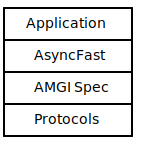

# AMGI

[](https://github.com/asyncfast/amgi/actions/workflows/tests.yml)
[](https://codecov.io/gh/asyncfast/amgi)

**AMGI** (*Asynchronous Messaging Gateway Interface*) is the message-driven sibling of
[ASGI](https://asgi.readthedocs.io/en/latest/).

Where ASGI standardises the interface between Python applications and HTTP servers, AMGI standardises the interface
between Python applications and message brokers.

It enables you to build broker-agnostic, strongly-typed, message-driven applications that are portable across protocols
and compute environments without rewriting business logic.

## Architecture



AMGI defines a clean separation between:

- Your application logic
- The framework layer (e.g. AsyncFast)
- The AMGI interface contract
- The underlying protocol implementation

Protocol implementations may include Kafka, SQS, MQTT, Redis, and others - but your application code remains unchanged.

## Why AMGI?

Modern systems are message-driven - but each broker has:

- Different client libraries
- Different runtime models
- Different infrastructure constraints
- Different deployment assumptions

AMGI introduces a minimal interface boundary so that:

- Switching brokers does not require rewriting your application
- Running in Lambda is no more complex than running on EC2
- Local development mirrors production semantics

If it runs on one protocol, it should run on another.

# AsyncFast - Typed Message APIs

This repository also includes **AsyncFast**, a typed microframework built on AMGI, inspired by
[FastAPI](https://fastapi.tiangolo.com/).

If FastAPI made HTTP APIs easy to build, AsyncFast aims to do the same for message-driven systems.

## Quick Example (AsyncFast)

```python
from typing import Annotated
from asyncfast import AsyncFast
from asyncfast import Header
from pydantic import BaseModel

app = AsyncFast()


class UserCreated(BaseModel):
    id: int
    email: str


@app.channel("user.created")
async def handle_user_created(
    payload: UserCreated,
    correlation_id: Annotated[str, Header()],
) -> None:
    print(f"User created: {payload.email} ({correlation_id})")
```

What you get automatically:

- Typed payload validation
- Typed headers
- Clean dependency injection
- AsyncAPI-aligned schema generation
- Broker portability

## Running on Kafka

```python
from amgi_aiokafka import Server

server = Server(
    app, "my-topic", bootstrap_servers="localhost:9092", group_id="my-group"
)

server.run()
```

or

```commandline
asyncfast run amgi-aiokafka main:app my-topic --group-id my-group
```

## Running in AWS Lambda (SQS Trigger)

```python
from amgi_sqs_event_source_mapping import SqsEventSourceMappingHandler

handler = SqsEventSourceMappingHandler(app)
```

The application code remains unchanged.

# What Is AMGI?

At its core, AMGI defines a minimal, low-level callable interface, similar in spirit to ASGI:

```python
async def app(scope, receive, send):
    message = await receive()

    await send(
        {
            "type": "message.ack",
            "id": message["id"],
        }
    )
```

AMGI provides:

- A standard application callable
- A structured message scope
- A receive mechanism
- A send mechanism

Frameworks like AsyncFast can be built on top of this interface.

# Core Aims

## Portable

Applications written against AMGI:

- Are independent of a specific broker
- Are independent of compute environment
- Can run in containers, VMs, or Lambda

Infrastructure changes should not rewrite business logic.

## Standards-Based

AMGI and AsyncFast are aligned with:

- [AsyncAPI](https://www.asyncapi.com/)
- [JSON Schema](https://json-schema.org/)
- Strong Python typing (Pydantic v2)

Schemas are first-class. Validation and documentation are built into the design.

## Clean Implementation

Each protocol implementation aims to be:

- Minimal
- Explicit
- Correct
- Efficient

This is engineered abstraction.

# Protocol Implementations

The following AMGI servers are currently available:

### Kafka

- **[amgi-aiokafka](https://pypi.org/project/amgi-aiokafka/)** - [Kafka](https://kafka.apache.org/) server
  implementation
- **[amgi-kafka-event-source-mapping](https://pypi.org/project/amgi-kafka-event-source-mapping/)** -
  [AWS Lambda](https://aws.amazon.com/lambda/) integration for Kafka

### MQTT

- **[amgi-paho-mqtt](https://pypi.org/project/amgi-paho-mqtt/)** - [MQTT](https://mqtt.org/) server implementation

### Redis

- **[amgi-redis](https://pypi.org/project/amgi-redis/)** - [Redis](https://redis.io/) server implementation

### SQS

- **[amgi-aiobotocore](https://pypi.org/project/amgi-aiobotocore/)** - Contains a [SQS](https://aws.amazon.com/sqs/)
  server implementation
- **[amgi-sqs-event-source-mapping](https://pypi.org/project/amgi-sqs-event-source-mapping/)** -
  [AWS Lambda](https://aws.amazon.com/lambda/) integration for SQS

## Documentation

- AMGI Specification\
  https://amgi.readthedocs.io/en/latest/

- AsyncFast Documentation\
  https://asyncfast.readthedocs.io/en/latest/

## Contact

For questions or suggestions, please contact [jack.burridge@mail.com](mailto:jack.burridge@mail.com).
